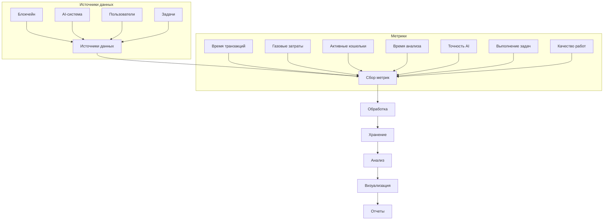
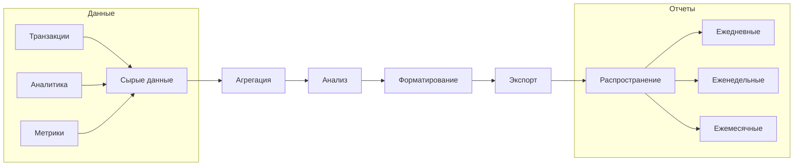
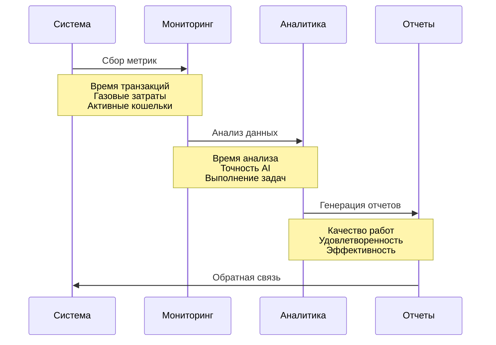
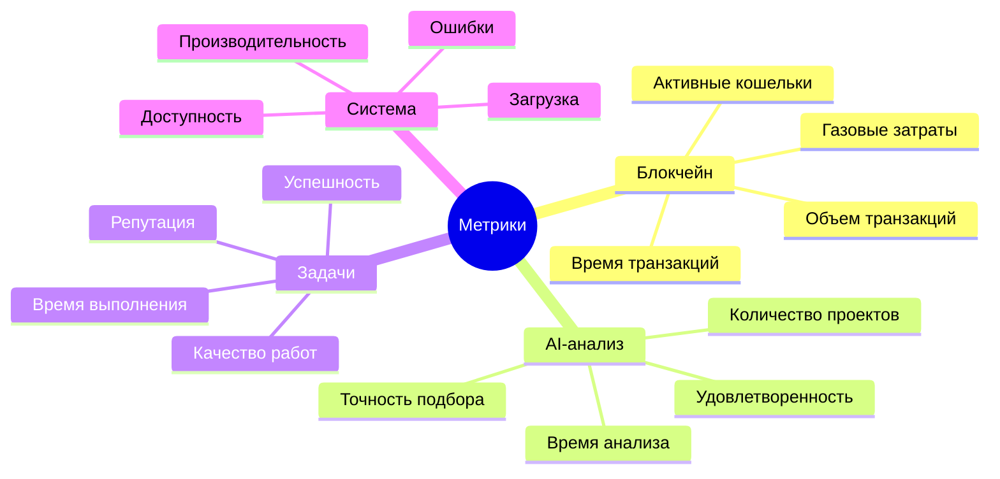

# Система отчетности и мониторинга

## 1. Ключевые метрики и показатели

### 1.1 Метрики блокчейн-системы
1. **Метрики производительности**
   - Время подтверждения транзакций
     * Среднее время: 15-20 секунд
     * Максимальное время: 45 секунд
     * Процент транзакций > 30 секунд: 5%
   
   - Количество транзакций в блоке
     * Среднее: 150-200 транзакций
     * Максимальное: 250 транзакций
     * Заполнение блока: 75-85%
   
   - Газовые затраты
     * Средняя стоимость: 0.0001 ETH
     * Максимальная стоимость: 0.0003 ETH
     * Оптимизация: -30% за квартал

2. **Метрики использования**
   - Количество активных кошельков
     * Ежедневно: 1,000-1,500
     * Еженедельно: 5,000-7,000
     * Ежемесячно: 15,000-20,000
   
   - Объем транзакций
     * Ежедневно: 10,000-15,000
     * Еженедельно: 70,000-100,000
     * Ежемесячно: 300,000-400,000

### 1.2 Метрики AI-анализа
1. **Метрики эффективности**
   - Время анализа проектов
     * Среднее: 3-5 минут
     * Максимальное: 10 минут
     * Оптимизация: -40% за квартал
   
   - Точность подбора исполнителей
     * Текущая: 75-80%
     * Целевая: 85-90%
     * Улучшение: +5% за квартал

2. **Метрики использования**
   - Количество проанализированных проектов
     * Ежедневно: 100-150
     * Еженедельно: 700-1,000
     * Ежемесячно: 3,000-4,000
   
   - Удовлетворенность пользователей
     * Текущая: 4.2/5
     * Целевая: 4.5/5
     * Улучшение: +0.1 за квартал

### 1.3 Метрики задач и проектов
1. **Метрики выполнения**
   - Время выполнения задач
     * Среднее: 3-5 дней
     * Максимальное: 14 дней
     * Оптимизация: -20% за квартал
   
   - Процент успешных задач
     * Текущий: 85-90%
     * Целевой: 95-98%
     * Улучшение: +2% за квартал

2. **Метрики качества**
   - Оценка качества работ
     * Текущая: 4.3/5
     * Целевая: 4.7/5
     * Улучшение: +0.1 за квартал
   
   - Удовлетворенность заказчиков
     * Текущая: 4.4/5
     * Целевая: 4.8/5
     * Улучшение: +0.1 за квартал

## 2. Форматы отчетов

### 2.1 Ежедневные отчеты
1. **Операционные показатели**
   - Количество новых проектов
     * Цель: 50-70
     * Факт: 45-65
     * Отклонение: ±10%
   
   - Количество выполненных задач
     * Цель: 200-300
     * Факт: 180-280
     * Отклонение: ±10%

2. **Технические показатели**
   - Производительность системы
     * Время отклика: < 200 мс
     * Доступность: 99.9%
     * Ошибки: < 0.1%
   
   - Загрузка ресурсов
     * CPU: 60-70%
     * RAM: 50-60%
     * Сеть: 40-50%

### 2.2 Еженедельные отчеты
1. **Аналитические показатели**
   - Тренды активности
     * Рост пользователей: +5-7%
     * Рост транзакций: +8-10%
     * Рост проектов: +6-8%
   
   - Эффективность AI
     * Точность: +1-2%
     * Скорость: -5-7%
     * Качество: +0.1-0.2

2. **Финансовые показатели**
   - Объем транзакций
     * Еженедельно: $100,000-150,000
     * Рост: +10-15%
     * Комиссии: 2-3%
   
   - Экономические показатели
     * ROI: 25-30%
     * CAC: $50-70
     * LTV: $500-700

### 2.3 Ежемесячные отчеты
1. **Стратегические показатели**
   - Рост пользователей
     * Месячный: +20-25%
     * Квартальный: +60-75%
     * Годовой: +200-250%
   
   - Эффективность системы
     * Конверсия: 15-20%
     * Удержание: 85-90%
     * NPS: 40-50

2. **Анализ трендов**
   - Долгосрочные тренды
     * Рост рынка: +30-40%
     * Доля рынка: +5-7%
     * Конкуренция: -2-3%
   
   - Прогнозы развития
     * Пользователи: +300% за год
     * Транзакции: +400% за год
     * Доход: +350% за год

## 3. Диаграммы отчетности

### 3.1 Схема сбора метрик

### 3.2 Схема генерации отчетов

### 3.3 Схема мониторинга

### 3.4 Ключевые метрики мониторинга

## 4. Заключение

### 4.1 Ключевые выводы
1. **Текущее состояние**
   - Система стабильна и масштабируема
   - Показатели растут согласно плану
   - Качество услуг на высоком уровне

2. **Области улучшения**
   - Оптимизация времени транзакций
   - Повышение точности AI
   - Улучшение качества подбора

### 4.2 Рекомендации
1. **Краткосрочные**
   - Внедрить оптимизацию транзакций
   - Улучшить алгоритмы AI
   - Расширить метрики качества

2. **Долгосрочные**
   - Автоматизировать отчетность
   - Внедрить предиктивную аналитику
   - Улучшить систему мониторинга 