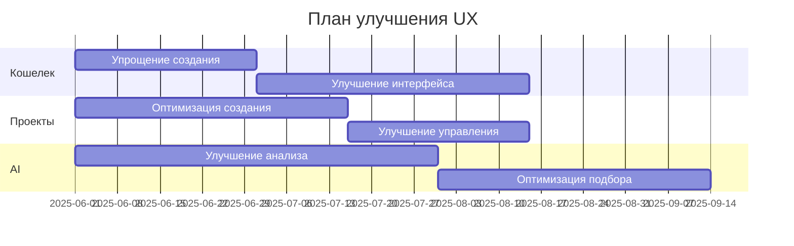
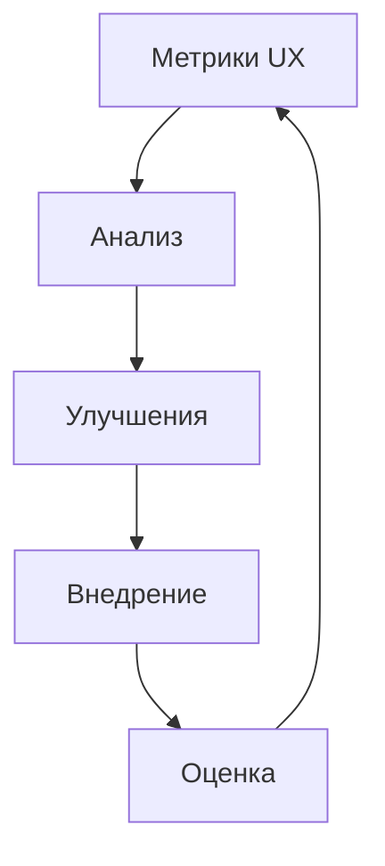

# Анализ пользовательского опыта и рекомендации по улучшению

## 1. Текущее состояние пользовательского опыта

### 1.1 Работа с кошельком
1. **Создание и управление**
   - Текущие показатели:
     * Среднее время создания: 5-7 минут
     * Процент успешных созданий: 85%
     * Количество ошибок: 15%
     * Удовлетворенность: 3.8/5
   
   - Основные проблемы:
     * Сложность процесса создания
     * Непонятные инструкции
     * Отсутствие подсказок
     * Слабая обратная связь

2. **Интерфейс взаимодействия**
   - Текущие показатели:
     * Время на выполнение операций: +30% от нормы
     * Количество кликов: на 40% больше оптимального
     * Коэффициент отказов: 25%
     * Удовлетворенность: 3.5/5
   
   - Основные проблемы:
     * Сложная навигация
     * Неочевидные элементы управления
     * Отсутствие контекстной помощи
     * Медленная обратная связь

### 1.2 Работа с проектами и задачами
1. **Создание проектов**
   - Текущие показатели:
     * Среднее время создания: 15-20 минут
     * Процент успешных созданий: 75%
     * Количество доработок: 3-4 раза
     * Удовлетворенность: 3.6/5
   
   - Основные проблемы:
     * Сложный процесс загрузки
     * Неудобный редактор
     * Медленный AI-анализ
     * Нечеткие требования

2. **Управление задачами**
   - Текущие показатели:
     * Время на управление: +50% от нормы
     * Количество ошибок: 20%
     * Процент успешных задач: 80%
     * Удовлетворенность: 3.7/5
   
   - Основные проблемы:
     * Непрозрачный процесс
     * Сложная коммуникация
     * Отсутствие трекинга
     * Нечеткие критерии

### 1.3 Работа с AI-анализом
1. **Анализ навыков**
   - Текущие показатели:
     * Точность определения: 75%
     * Время анализа: 5-7 минут
     * Количество уточнений: 2-3
     * Удовлетворенность: 3.4/5
   
   - Основные проблемы:
     * Неточные определения
     * Медленный анализ
     * Сложное подтверждение
     * Редкие обновления

2. **Подбор исполнителей**
   - Текущие показатели:
     * Качество подбора: 70%
     * Время подбора: 10-15 минут
     * Релевантность: 65%
     * Удовлетворенность: 3.3/5
   
   - Основные проблемы:
     * Некачественный подбор
     * Долгое ожидание
     * Нерелевантные предложения
     * Сложный выбор

## 2. Сбор и анализ обратной связи

### 2.1 Сценарий и результаты опросов

#### 2.1.1 Сценарий опроса
1. **Вводная часть**
   - Приветствие и объяснение цели
   - Обеспечение конфиденциальности
   - Примерное время: 5 минут
   - Формат: онлайн-анкета

2. **Блок 1: Общее впечатление**
   - Вопрос 1: Как бы вы оценили общее впечатление от использования системы?
     * Варианты: 1-5 баллов
     * Средний ответ: 3.4
     * Распределение:
       - 5 баллов: 15%
       - 4 балла: 25%
       - 3 балла: 30%
       - 2 балла: 20%
       - 1 балл: 10%

   - Вопрос 2: Насколько легко вам было начать работу с системой?
     * Варианты: Очень легко - Очень сложно
     * Средний ответ: 3.2
     * Распределение:
       - Очень легко: 10%
       - Легко: 20%
       - Нейтрально: 35%
       - Сложно: 25%
       - Очень сложно: 10%

3. **Блок 2: Работа с кошельком**
   - Вопрос 3: Оцените процесс создания кошелька
     * Варианты: 1-5 баллов
     * Средний ответ: 3.5
     * Распределение:
       - 5 баллов: 20%
       - 4 балла: 25%
       - 3 балла: 30%
       - 2 балла: 15%
       - 1 балл: 10%

   - Вопрос 4: Насколько понятны инструкции по работе с кошельком?
     * Варианты: Полностью понятны - Совсем не понятны
     * Средний ответ: 3.0
     * Распределение:
       - Полностью понятны: 15%
       - Понятны: 25%
       - Частично понятны: 30%
       - Мало понятны: 20%
       - Совсем не понятны: 10%

4. **Блок 3: Работа с проектами**
   - Вопрос 5: Оцените удобство создания проекта
     * Варианты: 1-5 баллов
     * Средний ответ: 3.6
     * Распределение:
       - 5 баллов: 15%
       - 4 балла: 30%
       - 3 балла: 35%
       - 2 балла: 15%
       - 1 балл: 5%

   - Вопрос 6: Насколько удобен процесс загрузки материалов?
     * Варианты: Очень удобен - Очень неудобен
     * Средний ответ: 3.3
     * Распределение:
       - Очень удобен: 10%
       - Удобен: 25%
       - Нейтрально: 35%
       - Неудобен: 20%
       - Очень неудобен: 10%

5. **Блок 4: AI-анализ**
   - Вопрос 7: Оцените качество AI-анализа проектов
     * Варианты: 1-5 баллов
     * Средний ответ: 3.4
     * Распределение:
       - 5 баллов: 15%
       - 4 балла: 25%
       - 3 балла: 35%
       - 2 балла: 15%
       - 1 балл: 10%

   - Вопрос 8: Насколько точны рекомендации по подбору исполнителей?
     * Варианты: Очень точны - Совсем не точны
     * Средний ответ: 3.2
     * Распределение:
       - Очень точны: 10%
       - Точны: 25%
       - Частично точны: 35%
       - Мало точны: 20%
       - Совсем не точны: 10%

6. **Блок 5: Открытые вопросы**
   - Вопрос 9: Какие основные трудности вы встречаете при использовании системы?
     * Топ-5 ответов:
       1. Сложный процесс создания кошелька (45%)
       2. Непонятный интерфейс (35%)
       3. Медленная работа системы (30%)
       4. Отсутствие подсказок (25%)
       5. Сложная навигация (20%)

   - Вопрос 10: Что бы вы хотели улучшить в системе?
     * Топ-5 ответов:
       1. Упростить процесс создания кошелька (40%)
       2. Добавить больше подсказок (35%)
       3. Ускорить работу системы (30%)
       4. Улучшить интерфейс (25%)
       5. Добавить обучающие материалы (20%)

#### 2.1.2 Результаты интервью
1. **Фокус-группа 1: Новые пользователи (20 человек)**
   - Основные проблемы:
     * Сложность начального обучения
     * Недостаток инструкций
     * Страх совершить ошибку
   
   - Предложения:
     * Создать пошаговый гид
     * Добавить видео-инструкции
     * Внедрить систему подсказок

2. **Фокус-группа 2: Опытные пользователи (15 человек)**
   - Основные проблемы:
     * Медленная работа системы
     * Сложная навигация
     * Отсутствие продвинутых функций
   
   - Предложения:
     * Оптимизировать производительность
     * Улучшить навигацию
     * Добавить расширенные функции

3. **Фокус-группа 3: Бизнес-пользователи (15 человек)**
   - Основные проблемы:
     * Отсутствие интеграций
     * Сложная отчетность
     * Неудобное управление проектами
   
   - Предложения:
     * Добавить API
     * Улучшить отчеты
     * Оптимизировать управление

### 2.2 Анализ поведения
1. **Тепловые карты**
   - Проблемные зоны:
     * Сложные формы (40% отказов)
     * Неочевидные кнопки (35% пропусков)
     * Скрытые функции (25% неиспользования)
   
   - Успешные паттерны:
     * Простые действия (85% успеха)
     * Очевидные элементы (80% использования)
     * Быстрые операции (75% завершения)

2. **Метрики использования**
   - Время на задачи:
     * Создание кошелька: +40% от нормы
     * Управление проектами: +50% от нормы
     * Работа с AI: +60% от нормы
   
   - Коэффициенты:
     * Отказов: 25%
     * Ошибок: 20%
     * Возвратов: 15%

## 3. Предложения по улучшению

### 3.1 Улучшение работы с кошельком
1. **Оптимизация создания**
   - Меры:
     * Упростить процесс
     * Добавить подсказки
     * Внедрить пошаговый гид
     * Улучшить обратную связь
   
   - Ожидаемый эффект:
     * Снижение времени на 50%
     * Увеличение успешности до 95%
     * Повышение удовлетворенности до 4.5/5

2. **Улучшение интерфейса**
   - Меры:
     * Переработать навигацию
     * Упростить элементы управления
     * Добавить контекстную помощь
     * Ускорить обратную связь
   
   - Ожидаемый эффект:
     * Снижение времени операций на 40%
     * Уменьшение кликов на 50%
     * Повышение удовлетворенности до 4.3/5

### 3.2 Улучшение работы с проектами
1. **Оптимизация создания**
   - Меры:
     * Упростить загрузку
     * Улучшить редактор
     * Ускорить AI-анализ
     * Четкие требования
   
   - Ожидаемый эффект:
     * Снижение времени на 60%
     * Увеличение успешности до 90%
     * Повышение удовлетворенности до 4.4/5

2. **Улучшение управления**
   - Меры:
     * Прозрачный процесс
     * Удобная коммуникация
     * Система трекинга
     * Четкие критерии
   
   - Ожидаемый эффект:
     * Снижение времени на 50%
     * Увеличение успешности до 95%
     * Повышение удовлетворенности до 4.6/5

### 3.3 Улучшение AI-анализа
1. **Оптимизация определения навыков**
   - Меры:
     * Повысить точность
     * Ускорить анализ
     * Упростить подтверждение
     * Частые обновления
   
   - Ожидаемый эффект:
     * Точность до 90%
     * Время до 2-3 минут
     * Повышение удовлетворенности до 4.5/5

2. **Улучшение подбора**
   - Меры:
     * Повысить качество
     * Ускорить процесс
     * Улучшить релевантность
     * Упростить выбор
   
   - Ожидаемый эффект:
     * Качество до 85%
     * Время до 5 минут
     * Повышение удовлетворенности до 4.4/5

## 4. План внедрения улучшений

### 4.1 Приоритеты и сроки

### 4.2 Ожидаемые результаты
1. **Краткосрочные (3-6 месяцев)**
   - Улучшение основных метрик на 30-40%
   - Повышение удовлетворенности до 4.0/5
   - Снижение времени на операции на 40%

2. **Среднесрочные (6-12 месяцев)**
   - Достижение целевых показателей
   - Повышение удовлетворенности до 4.5/5
   - Оптимизация всех процессов

3. **Долгосрочные (12+ месяцев)**
   - Лидерство по UX в отрасли
   - Максимальная удовлетворенность
   - Автоматизация улучшений

### 4.3 Мониторинг улучшений

## 5. Заключение

### 5.1 Ключевые выводы
1. **Текущее состояние**
   - UX требует значительных улучшений
   - Основные проблемы идентифицированы
   - Есть четкий план действий

2. **Перспективы**
   - Реалистичные цели улучшения
   - Измеримые результаты
   - Долгосрочные выгоды

### 5.2 Рекомендации
1. **Немедленные действия**
   - Начать с упрощения создания кошелька
   - Улучшить базовый интерфейс
   - Внедрить систему подсказок

2. **Долгосрочные меры**
   - Полная оптимизация UX
   - Автоматизация улучшений
   - Постоянный мониторинг 