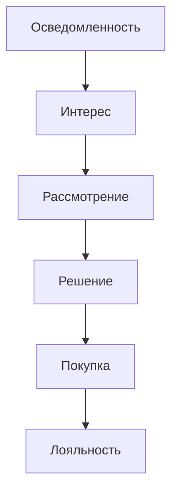
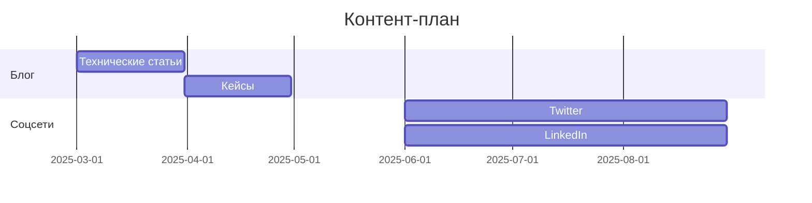
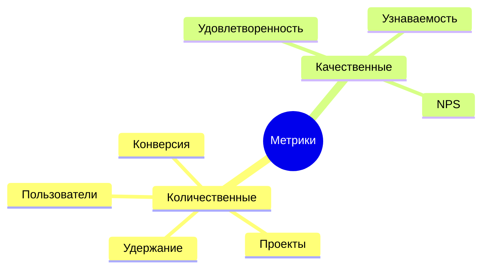

# Маркетинговый план

## 1. Анализ рынка

### 1.1 Целевая аудитория
1. **Демографические характеристики**
   - Возраст: 16-40 лет
   - Основные группы:
     * Программисты (40%)
     * Предприниматели (30%)
     * Стартапы (30%)
   
   - География:
     * Россия: 40%
     * СНГ: 30%
     * Европа: 20%
     * США: 10%

2. **Психографические характеристики**
   - Ценности:
     * Технологический прогресс
     * Инновации
     * Эффективность
     * Автоматизация
   
   - Поведение:
     * Активное использование технологий
     * Поиск оптимальных решений
     * Готовность к новому
     * Техническая грамотность

### 1.2 Анализ конкурентов
1. **Прямые конкуренты**
   - Upwork
     * Сильные стороны: Большая база, известность
     * Слабые стороны: Высокие комиссии, сложный интерфейс
     * Доля рынка: 35%
   
   - Freelancer
     * Сильные стороны: Низкие цены, простота
     * Слабые стороны: Низкое качество, спам
     * Доля рынка: 25%
   
   - Toptal
     * Сильные стороны: Качество, премиум
     * Слабые стороны: Высокие цены, строгий отбор
     * Доля рынка: 15%

2. **Косвенные конкуренты**
   - AestroHub
   - hireX
   - LinkedIn

## 2. Стратегия продвижения

### 2.1 Целевые показатели
1. **Количественные показатели**
   - Активные пользователи: 10,000 (год 1)
   - Проектов: 1,000 (год 1)
   - Конверсия: 5%
   - Удержание: 60%

2. **Качественные показатели**
   - Удовлетворенность: 4.5/5
   - NPS: 40 (индекс потребительской лояльности - Net Promoter Score)
   - Узнаваемость: 70% 

### 2.2 Каналы продвижения
1. **Онлайн-каналы**
   - Социальные сети:
     * Twitter: Технический контент, кейсы
     * LinkedIn: B2B продвижение, статьи
     * Telegram: Новости, обсуждения
     * GitHub: Технические решения
   
   - Контент-маркетинг:
     * Технический блог
     * Кейсы использования
     * Видео-инструкции
     * Вебинары

2. **Офлайн-каналы**
   - Мероприятия:
     * Конференции
     * Митапы
     * Воркшопы
     * Хакатоны
   
   - Партнерские программы:
     * Реферальная система
     * Аффилиаты
     * Интеграторы
     * Реселлеры

### 2.3 План продвижения
1. **Предзапуск (3 месяца)**
   - Подготовительный этап:
     * Создание лендинга
     * Подготовка контента
     * Настройка аналитики
     * Формирование базы
   
   - Анонс продукта:
     * Пресс-релизы
     * Социальные сети
     * Email-рассылки
     * Партнерские каналы

2. **Запуск (1 месяц)**
   - Основные активности:
     * Презентация продукта
     * Запуск партнеров
     * Промо-кампании
     * Специальные предложения
   
   - Поддерживающие активности:
     * Контент-план
     * Социальные активности
     * Email-маркетинг
     * Ретаргетинг

3. **Пост-запуск (3 месяца)**
   - Масштабирование:
     * Расширение каналов
     * Оптимизация конверсии
     * Увеличение охвата
     * Глубокая аналитика
   
   - Удержание:
     * Программы лояльности
     * Регулярные обновления
     * Сбор обратной связи
     * Поддержка сообщества

## 3. Бюджет и ROI

### 3.1 Затраты на продвижение
1. **Маркетинговый бюджет**
   - Контент-маркетинг: $50,000
   - Социальные сети: $30,000
   - Email-маркетинг: $20,000
   - Партнерские программы: $40,000
   - Мероприятия: $60,000
   - Итого: $200,000

2. **Операционные затраты**
   - Команда маркетинга: $120,000
   - Инструменты: $30,000
   - Аналитика: $20,000
   - Итого: $170,000

### 3.2 Ожидаемый ROI
1. **Прямые доходы**
   - Подписки: $500,000
   - Комиссии: $300,000
   - Премиум-функции: $200,000
   - Итого: $1,000,000

2. **Косвенные выгоды**
   - Рост базы пользователей
   - Улучшение репутации
   - Партнерские возможности
   - Сетевой эффект

## 4. Диаграммы анализа

### 4.1 Схема воронки продаж

### 4.2 Схема контент-плана

### 4.3 Схема метрик

## 5. Заключение

### 5.1 Ключевые выводы
1. **Рыночные возможности**
   - Растущий спрос на автоматизацию
   - Неудовлетворенность существующими решениями
   - Готовность к инновациям

2. **Конкурентные преимущества**
   - Уникальная технология
   - Фокус на качество
   - Гибкость решений

### 5.2 Рекомендации
1. **Немедленные действия**
   - Запустить подготовительный этап
   - Начать формирование базы
   - Разработать контент-план

2. **Долгосрочные меры**
   - Построение экосистемы
   - Развитие партнерств
   - Масштабирование каналов 