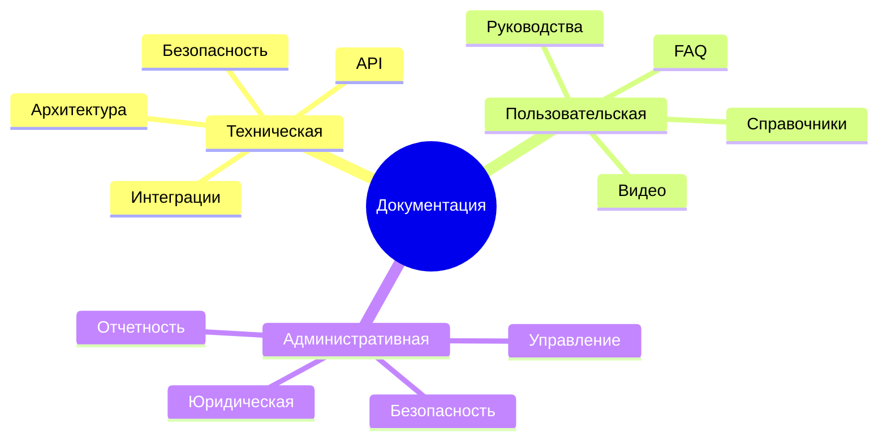
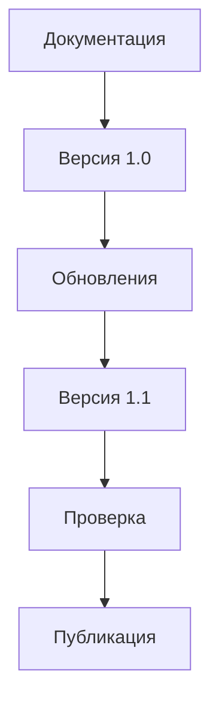
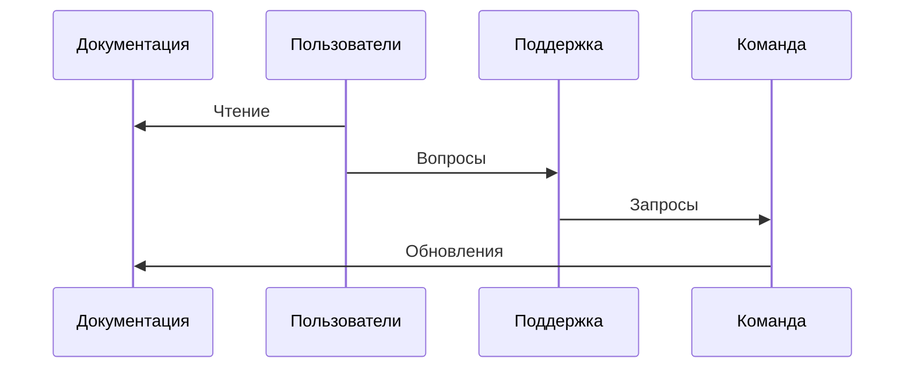

# Финальная документация

## 1. Структура документации

### 1.1 Навигация
1. **Быстрый доступ**
   - [Техническая документация](#2-техническая-документация)
   - [Пользовательская документация](#3-пользовательская-документация)
   - [Административная документация](#4-административная-документация)
   - [Диаграммы](#5-диаграммы)

2. **Поиск**
   - По ключевым словам
   - По категориям
   - По версиям
   - По дате обновления

### 1.2 Версионирование
1. **Текущая версия**
   - Версия: 1.0.0
   - Дата: 2025-03-01
   - Изменения: Первый релиз

2. **История версий**
   - Версия 1.0.0: Первый релиз
   - Версия 0.9.0: Бета-тестирование
   - Версия 0.8.0: Альфа-тестирование

## 2. Техническая документация

### 2.1 Архитектура системы
1. **Общее описание**
   - [Обзор системы](technical/architecture/overview.md)
   - [Компоненты](technical/architecture/components.md)
   - [Взаимодействия](technical/architecture/interactions.md)
   - [Технологический стек](technical/architecture/tech-stack.md)

2. **Блокчейн компоненты**
   - [Смарт-контракты](technical/blockchain/smart-contracts.md)
   - [Транзакции](technical/blockchain/transactions.md)
   - [Хранение данных](technical/blockchain/storage.md)
   - [Безопасность](technical/blockchain/security.md)

### 2.2 API документация
1. **Эндпоинты**
   - [Описание методов](technical/api/endpoints.md)
   - [Параметры](technical/api/parameters.md)
   - [Ответы](technical/api/responses.md)
   - [Ошибки](technical/api/errors.md)

2. **Примеры использования**
   - [Базовые сценарии](technical/api/examples/basic.md)
   - [Интеграции](technical/api/examples/integrations.md)
   - [Тестирование](technical/api/examples/testing.md)
   - [Отладка](technical/api/examples/debugging.md)

## 3. Пользовательская документация

### 3.1 Руководства
1. **Для заказчиков**
   - [Создание проектов](user/guides/customers/projects.md)
   - [Управление задачами](user/guides/customers/tasks.md)
   - [Работа с AI](user/guides/customers/ai.md)
   - [Оплата услуг](user/guides/customers/payment.md)

2. **Для исполнителей**
   - [Регистрация](user/guides/executors/registration.md)
   - [Поиск задач](user/guides/executors/tasks.md)
   - [Выполнение работ](user/guides/executors/work.md)
   - [Получение оплаты](user/guides/executors/payment.md)

### 3.2 Справочные материалы
1. **FAQ**
   - [Общие вопросы](user/faq/general.md)
   - [Технические вопросы](user/faq/technical.md)
   - [Безопасность](user/faq/security.md)
   - [Оплата](user/faq/payment.md)

2. **Видео-инструкции**
   - [Базовые функции](user/videos/basic.md)
   - [Продвинутые функции](user/videos/advanced.md)
   - [Решение проблем](user/videos/troubleshooting.md)
   - [Советы и рекомендации](user/videos/tips.md)

## 4. Административная документация

### 4.1 Руководство администратора
1. **Управление системой**
   - [Настройки](admin/management/settings.md)
   - [Мониторинг](admin/management/monitoring.md)
   - [Резервное копирование](admin/management/backup.md)
   - [Обновления](admin/management/updates.md)

2. **Безопасность**
   - [Доступы](admin/security/access.md)
   - [Аудит](admin/security/audit.md)
   - [Инциденты](admin/security/incidents.md)
   - [Восстановление](admin/security/recovery.md)

### 4.2 Юридическая документация
1. **Пользовательские соглашения**
   - [Условия использования](admin/legal/terms.md)
   - [Политика конфиденциальности](admin/legal/privacy.md)
   - [Правила платформы](admin/legal/rules.md)
   - [Ответственность](admin/legal/liability.md)

2. **Регуляторные документы**
   - [Лицензии](admin/legal/licenses.md)
   - [Соответствия](admin/legal/compliance.md)
   - [Отчетность](admin/legal/reporting.md)
   - [Аудит](admin/legal/audit.md)

## 5. Диаграммы

### 5.1 Схема структуры документации

### 5.2 Схема версионирования

### 5.3 Схема поддержки

## 6. Заключение

### 6.1 Поддержка документации
1. **Обновления**
   - Еженедельные проверки
   - Ежемесячные обновления
   - Квартальные ревизии
   - Годовые аудиты

2. **Обратная связь**
   - Форма обратной связи
   - Система тикетов
   - Сообщество
   - Поддержка

### 6.2 Контакты
1. **Поддержка**
   - Бот: Telegram
   - Форум: community.solariusx.com

2. **Разработка**
   - GitHub: github.com/solariusx
   - Документация: docs.solariusx.com
   - API: api.solariusx.com
   - Roadmap: roadmap.solariusx.com 