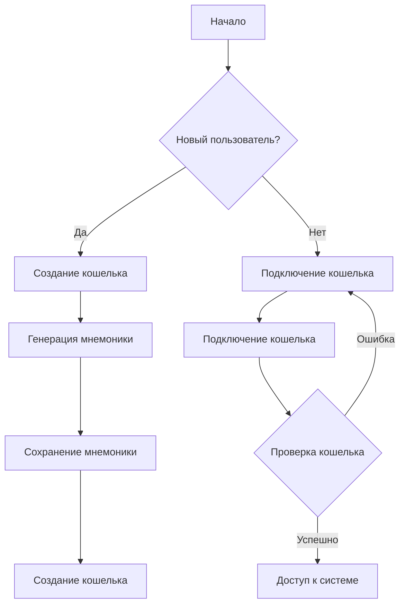
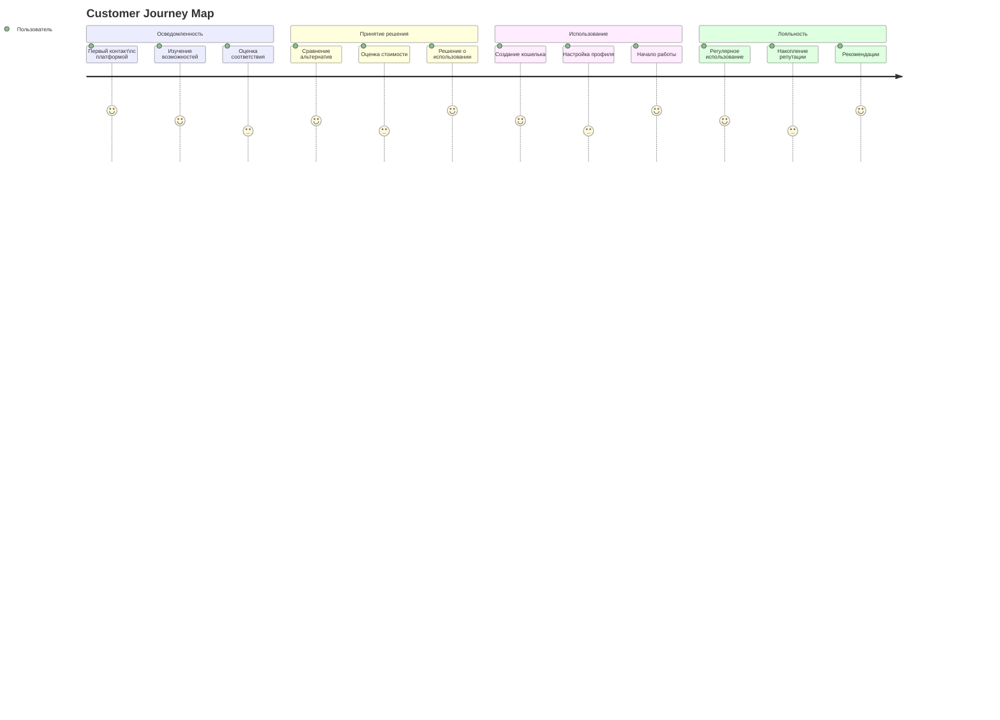
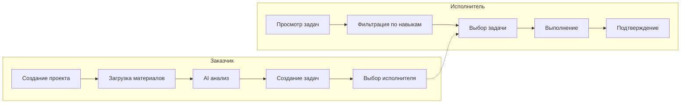
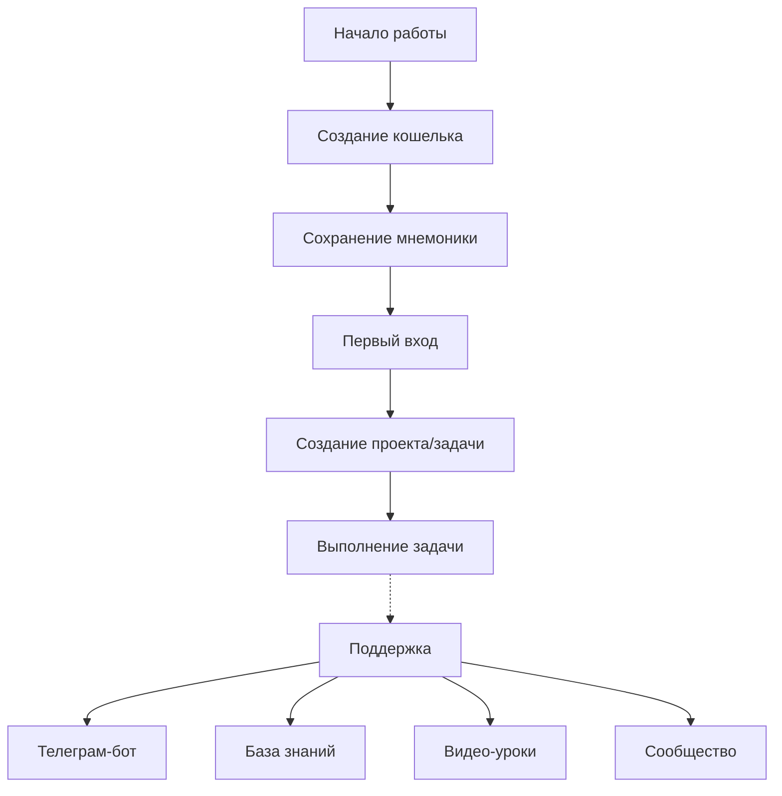
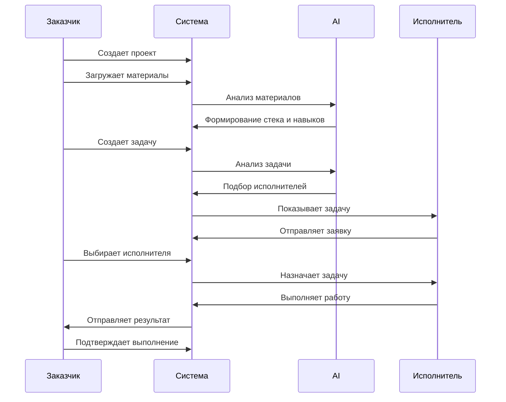

# Пользовательские сценарии и потоки

## 1. Основные пользовательские потоки

### 1.1 Создание кошелька и вход в систему
1. **Сценарий создания кошелька**
   - Пользователь инициирует создание нового кошелька
   - Система генерирует мнемоническую фразу из 12 слов
   - Пользователь сохраняет мнемоническую фразу
   - Система создает кошелек и предоставляет доступ

2. **Сценарий входа в систему**
   - Пользователь подключает свой кошелек
   - Система проверяет подлинность кошелька
   - При успешной проверке открывается личный кабинет

### 1.2 Профиль исполнителя
1. **Сценарий заполнения навыков**
   - Исполнитель указывает свои навыки и опыт
   - Система анализирует введенные данные
   - AI формирует матрицу компетенций
   - Исполнитель подтверждает навыки через модуль подтверждения

2. **Сценарий обновления профиля**
   - Исполнитель выполняет задачи
   - Система автоматически обновляет матрицу компетенций
   - AI корректирует уровень владения навыками

### 1.3 Работа с проектами (Заказчик)
1. **Сценарий создания проекта**
   - Заказчик создает новый проект
   - Загружает документацию, код, материалы
   - AI анализирует материалы и формирует:
     - Стек технологий
     - Описание проекта
     - Предметную область
     - Необходимые навыки
     - Уровни владения навыками

2. **Сценарий создания задачи**
   - Заказчик создает задачу в проекте
   - AI анализирует описание задачи
   - Система подбирает релевантных исполнителей
   - Заказчик выбирает исполнителя

### 1.4 Работа с задачами (Исполнитель)
1. **Сценарий поиска задач**
   - Исполнитель просматривает доступные задачи
   - Система фильтрует задачи по компетенциям
   - Исполнитель выбирает подходящую задачу
   - Отправляет заявку на выполнение

2. **Сценарий выполнения задачи**
   - Исполнитель получает задачу
   - Выполняет работу
   - Отправляет результат
   - Получает подтверждение выполнения

## 2. Customer Journey Map

### 2.1 Этапы взаимодействия
1. **Осведомленность**
   - Первый контакт с платформой
   - Изучение возможностей
   - Оценка соответствия потребностям

2. **Принятие решения**
   - Сравнение с альтернативами
   - Оценка стоимости и выгод
   - Решение о использовании

3. **Использование**
   - Создание кошелька
   - Настройка профиля
   - Начало работы с платформой

4. **Лояльность**
   - Регулярное использование
   - Накопление репутации
   - Рекомендации другим пользователям

## 3. Ключевые точки взаимодействия

### 3.1 Критические точки
- Создание кошелька и сохранение мнемоники
- Первый вход в систему
- Создание первого проекта/задачи
- Выполнение первой задачи

### 3.2 Точки поддержки
- Телеграм-бот для технической поддержки
- База знаний и FAQ
- Видео-уроки по работе с платформой
- Сообщество пользователей

# Диаграммы пользовательских потоков

## 1. Диаграмма процесса создания кошелька и входа

## 2. Customer Journey Map

## 3. Диаграмма взаимодействия с проектом

## 4. Диаграмма критических точек взаимодействия

## 5. Диаграмма процесса работы с задачами

