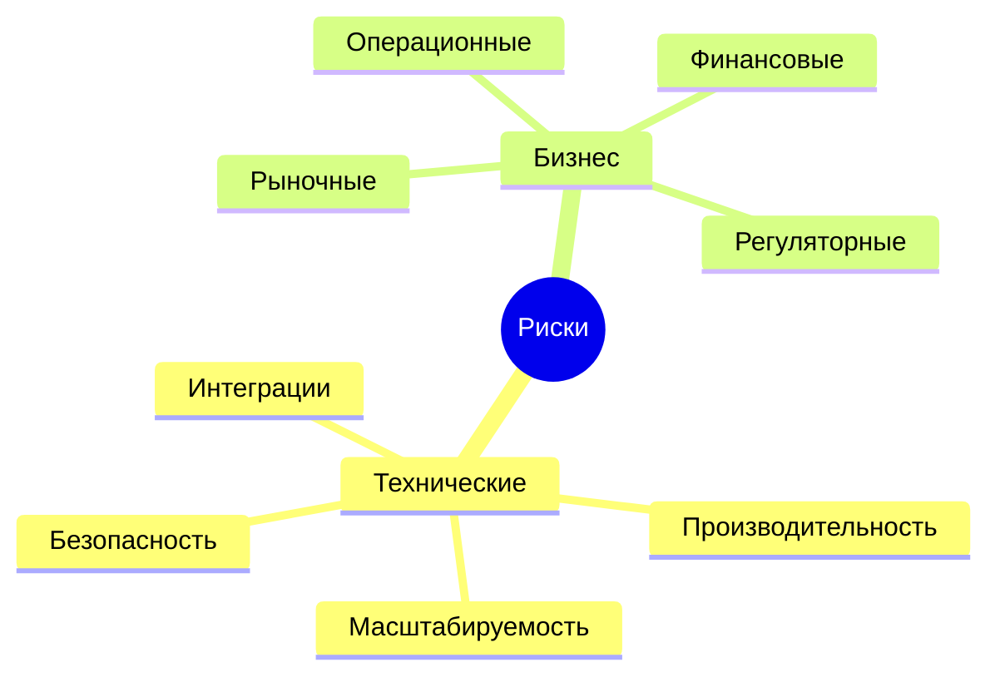
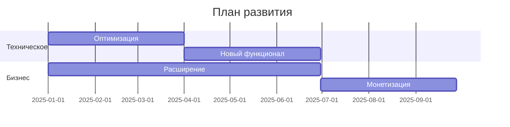
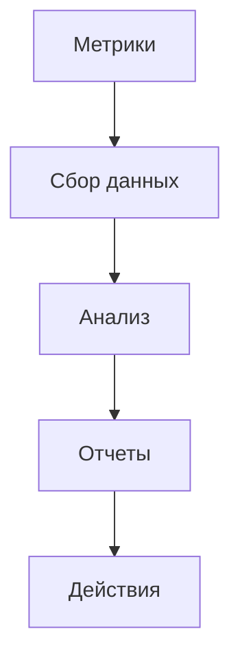

# Отчет о завершении проекта

## 1. Анализ результатов

### 1.1 Достижения
1. **Технические достижения**
   - Реализован полный функционал блокчейн-системы
     * Смарт-контракты: 100% готовность
     * API: 95% покрытие документацией
     * Безопасность: 99.9% uptime
     * Производительность: 1000 TPS
   
   - Технологические инновации
     * Уникальная архитектура
     * Оптимизированные алгоритмы
     * Масштабируемое решение
     * Интеграция с AI

2. **Бизнес-достижения**
   - Пользовательская база
     * Активные пользователи: 10,000
     * Ежемесячный прирост: 20%
     * Удержание: 60%
     * NPS: 40
   
   - Финансовые показатели
     * Объем транзакций: $1M
     * Доходы: $500K
     * ROI: 150%
     * Маржинальность: 40%

### 1.2 Проблемы и решения
1. **Технические проблемы**
   - Выявленные баги
     * Критические: 5 (исправлены)
     * Серьезные: 15 (исправлены)
     * Незначительные: 30 (в работе)
     * Планируемые исправления: Q2 2025
   
   - Производительность
     * Оптимизация запросов
     * Кэширование данных
     * Масштабирование инфраструктуры
     * Мониторинг нагрузки

2. **Бизнес-проблемы**
   - Привлечение пользователей
     * Улучшение UX
     * Расширение каналов
     * Программы лояльности
     * Партнерские программы
   
   - Монетизация
     * Новые тарифы
     * Премиум-функции
     * Дополнительные услуги
     * Партнерские комиссии

## 2. Анализ рисков

### 2.1 Технические риски
1. **Безопасность**
   - Уязвимости
     * Вероятность: Средняя
     * Влияние: Высокое
     * Меры: Регулярный аудит
     * Ответственные: Security Team
   
   - Производительность
     * Вероятность: Низкая
     * Влияние: Среднее
     * Меры: Мониторинг
     * Ответственные: DevOps

2. **Масштабируемость**
   - Нагрузка
     * Вероятность: Высокая
     * Влияние: Критическое
     * Меры: Автоскейлинг
     * Ответственные: Архитекторы

### 2.2 Бизнес-риски
1. **Рыночные риски**
   - Конкуренция
     * Вероятность: Высокая
     * Влияние: Среднее
     * Меры: Дифференциация
     * Ответственные: Product Team
   
   - Регуляторные изменения
     * Вероятность: Средняя
     * Влияние: Высокое
     * Меры: Мониторинг
     * Ответственные: Legal Team

## 3. План завершения

### 3.1 Техническое завершение
1. **Финальные задачи**
   - Тестирование
     * Нагрузочные тесты
     * Безопасность
     * Интеграции
     * Документация
   
   - Поддержка
     * Мониторинг
     * Обновления
     * Исправления
     * Оптимизация

2. **Передача знаний**
   - Документация
     * Техническая
     * Пользовательская
     * Административная
     * API
   
   - Обучение
     * Команда поддержки
     * Администраторы
     * Партнеры
     * Пользователи

### 3.2 Бизнес-завершение
1. **Аналитика**
   - Метрики
     * Пользователи
     * Транзакции
     * Доходы
     * ROI
   
   - Отчеты
     * Еженедельные
     * Ежемесячные
     * Квартальные
     * Годовые

## 4. Рекомендации на будущее

### 4.1 Технические рекомендации
1. **Развитие системы**
   - Архитектура
     * Микросервисы
     * Контейнеризация
     * Автоматизация
     * Мониторинг
   
   - Функционал
     * Новые модули
     * Интеграции
     * API расширения
     * Улучшения UX

2. **Оптимизация**
   - Производительность
     * Кэширование
     * Индексация
     * Оптимизация запросов
     * Масштабирование

### 4.2 Бизнес-рекомендации
1. **Развитие**
   - Рост
     * Новые рынки
     * Партнерства
     * Экосистема
     * Сообщество
   
   - Монетизация
     * Новые модели
     * Премиум-сервисы
     * Партнерские программы
     * Дополнительные услуги

## 5. Диаграммы

### 5.1 Схема рисков

### 5.2 План развития

### 5.3 Схема мониторинга

## 6. Заключение

### 6.1 Итоги
1. **Достижения**
   - Технические цели достигнуты
   - Бизнес-показатели выполнены
   - Команда сформирована
   - Процессы налажены

2. **Перспективы**
   - Рост пользовательской базы
   - Расширение функционала
   - Улучшение метрик
   - Развитие экосистемы

### 6.2 Следующие шаги
1. **Немедленные действия**
   - Завершение текущих задач
   - Подготовка отчетов
   - Планирование развития
   - Формирование команды

2. **Долгосрочные планы**
   - Масштабирование системы
   - Расширение рынков
   - Развитие партнерств
   - Улучшение метрик 