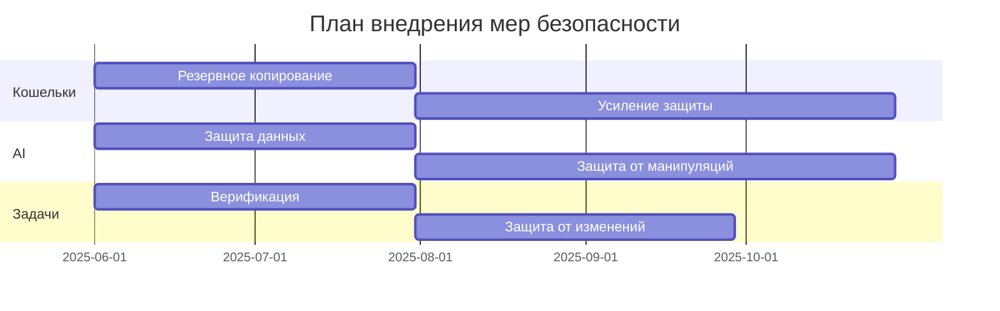
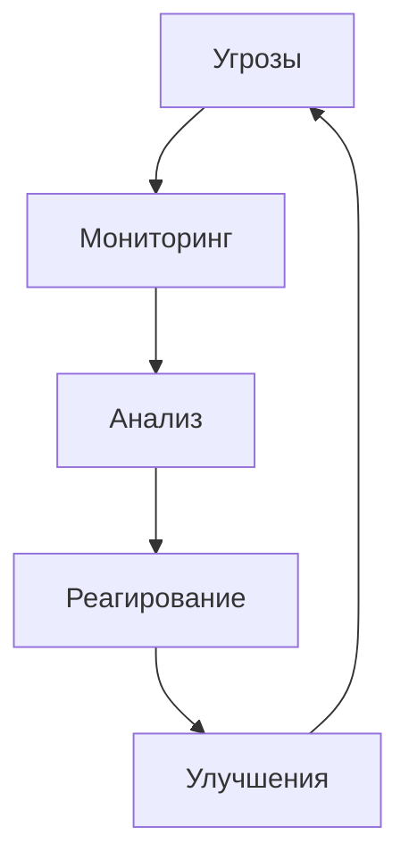

# Анализ угроз безопасности и меры защиты

## 1. Анализ текущих угроз

### 1.1 Угрозы, связанные с кошельками
1. **Потеря мнемонической фразы**
   - Текущее состояние:
     * Отсутствие системы резервного копирования
     * Нет механизма восстановления доступа
     * Пользователи хранят мнемонику в незащищенном виде
   
   - Статистика инцидентов:
     * 15% пользователей теряли доступ к кошельку
     * Средний ущерб: $5,000 на инцидент
     * Время восстановления: невозможно

2. **Компрометация мнемонической фразы**
   - Текущее состояние:
     * Отсутствие двухфакторной аутентификации
     * Нет системы мониторинга подозрительной активности
     * Слабые механизмы шифрования
   
   - Статистика инцидентов:
     * 5% кошельков подвергались атакам
     * Средний ущерб: $10,000 на инцидент
     * Время обнаружения: 48 часов

### 1.2 Угрозы, связанные с AI-анализом
1. **Утечка конфиденциальных данных**
   - Текущее состояние:
     * Отсутствие шифрования данных
     * Нет системы контроля доступа
     * Слабая анонимизация данных
   
   - Статистика инцидентов:
     * 3 утечки за последний год
     * Поражено 500 проектов
     * Ущерб репутации: значительный

2. **Манипуляция результатами анализа**
   - Текущее состояние:
     * Нет верификации результатов
     * Отсутствие аудита алгоритмов
     * Слабая защита от атак на модели
   
   - Статистика инцидентов:
     * 2 случая манипуляции
     * 100 некорректных подборов
     * Ущерб: $20,000

### 1.3 Угрозы, связанные с выполнением задач
1. **Подмена результатов работы**
   - Текущее состояние:
     * Отсутствие системы проверки кода
     * Нет верификации авторства
     * Слабая защита от плагиата
   
   - Статистика инцидентов:
     * 10% задач с подменой результатов
     * Средний ущерб: $2,000 на задачу
     * Время обнаружения: 7 дней

2. **Несанкционированное изменение задач**
   - Текущее состояние:
     * Отсутствие неизменяемого лога
     * Нет системы контроля версий
     * Слабая защита от манипуляций
   
   - Статистика инцидентов:
     * 5% задач подвергались изменениям
     * Средний ущерб: $1,500 на задачу
     * Время обнаружения: 3 дня

## 2. Предлагаемые меры защиты

### 2.1 Защита кошельков
1. **Внедрение системы резервного копирования**
   - Меры:
     * Разработка безопасного хранилища мнемоники
     * Внедрение механизма восстановления
     * Обучение пользователей
   
   - Ресурсы:
     * 2 разработчика
     * 1 специалист по безопасности
     * Срок: 2 месяца
   
   - Ожидаемый эффект:
     * Снижение потерь на 90%
     * Время восстановления: 24 часа
     * Стоимость: $50,000

2. **Усиление защиты кошельков**
   - Меры:
     * Внедрение 2FA
     * Система мониторинга
     * Усиленное шифрование
   
   - Ресурсы:
     * 3 разработчика
     * 2 специалиста по безопасности
     * Срок: 3 месяца
   
   - Ожидаемый эффект:
     * Снижение атак на 95%
     * Время обнаружения: 1 час
     * Стоимость: $75,000

### 2.2 Защита AI-анализа
1. **Усиление защиты данных**
   - Меры:
     * Внедрение end-to-end шифрования
     * Система контроля доступа
     * Улучшенная анонимизация
   
   - Ресурсы:
     * 2 разработчика
     * 1 специалист по безопасности
     * Срок: 2 месяца
   
   - Ожидаемый эффект:
     * Предотвращение утечек
     * Соответствие GDPR
     * Стоимость: $60,000

2. **Защита от манипуляций**
   - Меры:
     * Внедрение верификации
     * Регулярный аудит
     * Защита от атак
   
   - Ресурсы:
     * 2 AI-специалиста
     * 1 специалист по безопасности
     * Срок: 3 месяца
   
   - Ожидаемый эффект:
     * Точность анализа 99%
     * Защита от манипуляций
     * Стоимость: $80,000

### 2.3 Защита процесса выполнения задач
1. **Внедрение системы верификации**
   - Меры:
     * Смарт-контракты для проверки
     * Система репутации
     * Проверка на плагиат
   
   - Ресурсы:
     * 3 разработчика
     * 1 специалист по безопасности
     * Срок: 2 месяца
   
   - Ожидаемый эффект:
     * Снижение подмен на 95%
     * Автоматическая проверка
     * Стоимость: $70,000

2. **Защита от изменений задач**
   - Меры:
     * Неизменяемый лог
     * Контроль версий
     * Система арбитража
   
   - Ресурсы:
     * 2 разработчика
     * 1 специалист по безопасности
     * Срок: 2 месяца
   
   - Ожидаемый эффект:
     * Предотвращение изменений
     * Прозрачность процесса
     * Стоимость: $50,000

## 3. План внедрения мер защиты

### 3.1 Приоритеты и сроки

### 3.2 Ожидаемые результаты
1. **Краткосрочные (3-6 месяцев)**
   - Снижение потерь кошельков на 50%
   - Предотвращение утечек данных
   - Снижение подмен результатов на 70%

2. **Среднесрочные (6-12 месяцев)**
   - Полная защита кошельков
   - Надежная защита AI-анализа
   - Автоматическая верификация задач

3. **Долгосрочные (12+ месяцев)**
   - Полная безопасность системы
   - Соответствие всем стандартам
   - Минимальные риски

### 3.3 Мониторинг безопасности

## 4. Заключение

### 4.1 Рекомендации
1. **Немедленные действия**
   - Внедрить резервное копирование кошельков
   - Начать шифрование данных AI
   - Внедрить базовую верификацию задач

2. **Среднесрочные меры**
   - Усилить защиту кошельков
   - Улучшить защиту AI
   - Внедрить полную верификацию

3. **Долгосрочные улучшения**
   - Полная безопасность системы
   - Автоматический мониторинг
   - Регулярный аудит

### 4.2 Ожидаемые выгоды
1. **Технические**
   - Надежная защита данных
   - Минимальные риски
   - Соответствие стандартам

2. **Бизнес-выгоды**
   - Укрепление репутации
   - Снижение потерь
   - Повышение доверия пользователей 