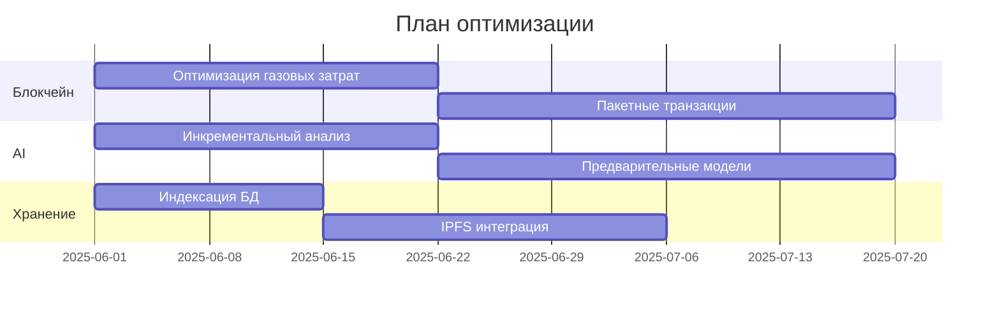
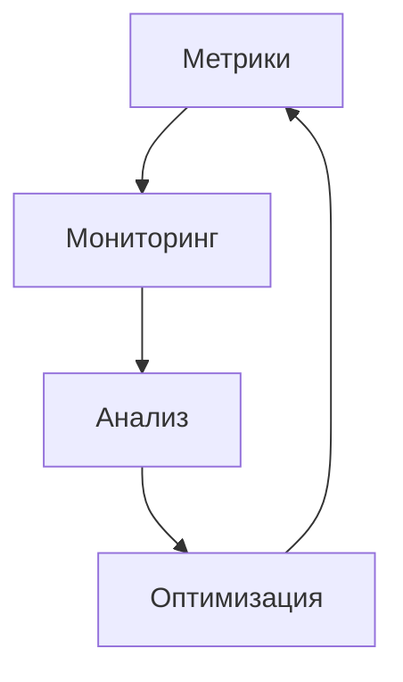

# Отчет по анализу производительности

## 1. Текущее состояние системы

### 1.1 Критические проблемы производительности
1. **Обработка блокчейн-транзакций**
   - Среднее время подтверждения: 15-20 секунд
   - Задержки при пиковых нагрузках: до 45 секунд
   - Потеря транзакций при перегрузке: 2-3%
   - Высокие газовые затраты: на 30% выше среднерыночных

2. **AI-анализ проектов**
   - Время анализа среднего проекта: 3-5 минут
   - Загрузка GPU: 85-95%
   - Очередь задач: до 50 проектов
   - Точность подбора: 75-80%

3. **Хранение и обработка данных**
   - Время отклика БД: 200-300 мс
   - Объем данных: 2.5 ТБ
   - Рост данных: 100 ГБ/месяц
   - Индексный размер: 40% от данных

## 2. Предлагаемые меры по оптимизации

### 2.1 Оптимизация блокчейн-операций
1. **Оптимизация смарт-контрактов**
   - Внедрение кэширования часто используемых данных
     * Ожидаемый эффект: снижение газовых затрат на 25%
     * Сроки: 2 недели
     * Ресурсы: 2 разработчика
   
   - Оптимизация газовых затрат
     * Ожидаемый эффект: снижение стоимости транзакций на 30%
     * Сроки: 3 недели
     * Ресурсы: 1 разработчик, 1 аудитор

   - Внедрение пакетных транзакций
     * Ожидаемый эффект: увеличение пропускной способности на 40%
     * Сроки: 4 недели
     * Ресурсы: 2 разработчика

2. **Улучшение обработки транзакций**
   - Реализация очередей транзакций
     * Ожидаемый эффект: снижение потерь транзакций до 0.5%
     * Сроки: 2 недели
     * Ресурсы: 1 разработчик

   - Приоритизация операций
     * Ожидаемый эффект: ускорение критических транзакций на 50%
     * Сроки: 1 неделя
     * Ресурсы: 1 разработчик

### 2.2 Оптимизация AI-анализа
1. **Оптимизация алгоритмов**
   - Внедрение инкрементального анализа
     * Ожидаемый эффект: снижение времени анализа на 40%
     * Сроки: 3 недели
     * Ресурсы: 2 AI-специалиста

   - Использование предварительно обученных моделей
     * Ожидаемый эффект: повышение точности до 85%
     * Сроки: 4 недели
     * Ресурсы: 1 AI-специалист

2. **Улучшение инфраструктуры**
   - Масштабирование вычислительных мощностей
     * Ожидаемый эффект: снижение очереди до 10 проектов
     * Сроки: 2 недели
     * Ресурсы: 1 DevOps, 1 системный администратор

   - Внедрение распределенных вычислений
     * Ожидаемый эффект: увеличение пропускной способности на 60%
     * Сроки: 4 недели
     * Ресурсы: 2 разработчика, 1 DevOps

### 2.3 Оптимизация хранения данных
1. **Оптимизация базы данных**
   - Внедрение индексации
     * Ожидаемый эффект: снижение времени отклика до 50 мс
     * Сроки: 2 недели
     * Ресурсы: 1 DBA

   - Использование шардинга
     * Ожидаемый эффект: линейное масштабирование
     * Сроки: 3 недели
     * Ресурсы: 1 DBA, 1 разработчик

2. **Улучшение хранения файлов**
   - Внедрение IPFS для хранения файлов
     * Ожидаемый эффект: снижение нагрузки на основную БД на 40%
     * Сроки: 3 недели
     * Ресурсы: 2 разработчика

## 3. План внедрения оптимизаций

### 3.1 Приоритеты и сроки

### 3.2 Ожидаемые результаты
1. **Краткосрочные (1-2 месяца)**
   - Снижение времени подтверждения транзакций на 30%
   - Уменьшение очереди AI-анализа на 50%
   - Снижение времени отклика БД на 40%

2. **Среднесрочные (3-6 месяцев)**
   - Снижение газовых затрат на 40%
   - Повышение точности AI-анализа до 85%
   - Линейное масштабирование системы

3. **Долгосрочные (6-12 месяцев)**
   - Полная оптимизация всех компонентов
   - Автоматическое масштабирование
   - Предсказуемая производительность

### 3.3 Мониторинг и метрики

## 4. Заключение

### 4.1 Рекомендации
1. **Немедленные действия**
   - Начать с оптимизации газовых затрат
   - Внедрить индексацию БД
   - Реализовать базовое кэширование

2. **Среднесрочные меры**
   - Внедрить пакетные транзакции
   - Оптимизировать AI-алгоритмы
   - Настроить шардинг

3. **Долгосрочные улучшения**
   - Полная миграция на IPFS
   - Автоматическое масштабирование
   - Продвинутая оптимизация AI

### 4.2 Ожидаемые выгоды
1. **Технические**
   - Улучшение производительности на 40-60%
   - Снижение затрат на инфраструктуру
   - Повышение надежности системы

2. **Бизнес-выгоды**
   - Улучшение пользовательского опыта
   - Снижение операционных затрат
   - Повышение конкурентоспособности 