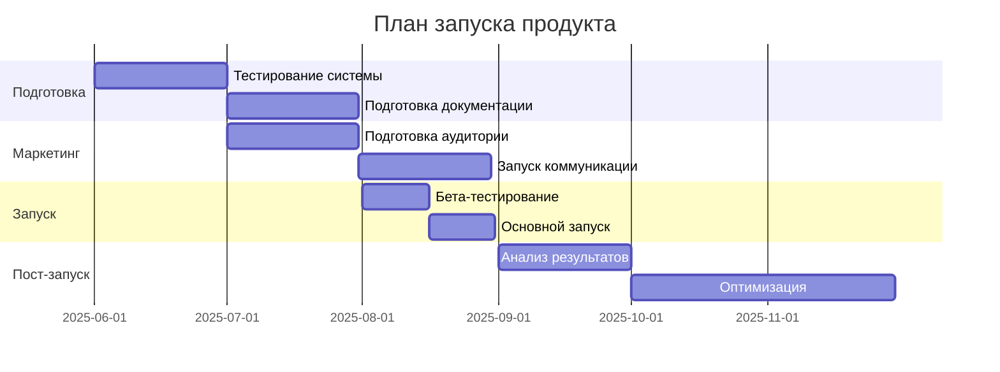

# План запуска продукта

## 1. Подготовительный этап (3 месяца до запуска)

### 1.1 Техническая подготовка
1. **Тестирование и оптимизация**
   - Стресс-тесты системы
   - Проверка безопасности
   - Аудит смарт-контрактов
   - Тестирование AI-моделей
   - Ресурсы: 5 разработчиков, 2 тестировщика
   - Срок: 1 месяц

2. **Инфраструктура**
   - Масштабирование серверов
   - Настройка мониторинга
   - Подготовка резервных копий
   - Настройка CI/CD
   - Ресурсы: 2 DevOps-инженера
   - Срок: 2 недели

### 1.2 Подготовка документации
1. **Техническая документация**
   - API документация
   - Руководство по развертыванию
   - Описание архитектуры
   - Инструкции по безопасности
   - Ресурсы: 2 технических писателя
   - Срок: 1 месяц

2. **Пользовательская документация**
   - Руководство пользователя
   - FAQ
   - Видео-инструкции
   - Примеры использования
   - Ресурсы: 1 UX-писатель, 1 видеограф
   - Срок: 1 месяц

## 2. Маркетинговая подготовка (2 месяца до запуска)

### 2.1 Продвижение продукта
1. **Целевая аудитория**
   - Заказчики проектов
   - Исполнители задач
   - Разработчики
   - Бизнес-пользователи
   - Ресурсы: 2 маркетолога
   - Срок: 2 недели

2. **Каналы продвижения**
   - Социальные сети (Twitter, LinkedIn, Telegram)
   - Технические блоги
   - Крипто-сообщества
   - Партнерские программы
   - Ресурсы: 2 SMM-специалиста
   - Срок: 1 месяц

### 2.2 Коммуникация
1. **Внутренняя коммуникация**
   - Обучение команды
   - Подготовка поддержки
   - Планы реагирования
   - Эскалационные процедуры
   - Ресурсы: 1 HR-специалист
   - Срок: 2 недели

2. **Внешняя коммуникация**
   - Пресс-релизы
   - Блог-посты
   - Социальные сети
   - Email-рассылки
   - Ресурсы: 1 PR-менеджер
   - Срок: 1 месяц

## 3. Этап запуска (1 месяц)

### 3.1 Предварительный запуск
1. **Закрытое бета-тестирование**
   - Приглашение первых пользователей
   - Сбор обратной связи
   - Исправление ошибок
   - Ресурсы: 3 тестировщика, 2 разработчика
   - Срок: 2 недели

2. **Подготовка финальной версии**
   - Внедрение исправлений
   - Финальное тестирование
   - Подготовка к масштабированию
   - Ресурсы: 5 разработчиков
   - Срок: 2 недели

### 3.2 Основной запуск
1. **Открытие регистрации**
   - Запуск маркетинга
   - Мониторинг системы
   - Сбор метрик
   - Ресурсы: Вся команда
   - Срок: 1 неделя

2. **Масштабирование**
   - Увеличение серверов
   - Оптимизация нагрузки
   - Мониторинг производительности
   - Ресурсы: 2 DevOps-инженера
   - Срок: 1 неделя

## 4. Пост-запуск (3 месяца)

### 4.1 Анализ и оптимизация
1. **Анализ результатов**
   - Метрики использования
   - Обратная связь пользователей
   - Технические показатели
   - Ресурсы: 2 аналитика
   - Срок: 1 месяц

2. **Оптимизация системы**
   - Исправление ошибок
   - Улучшение производительности
   - Добавление новых функций
   - Ресурсы: 5 разработчиков
   - Срок: 2 месяца

### 4.2 Поддержка и развитие
1. **Техническая поддержка**
   - Обработка запросов
   - Решение проблем
   - Обновление документации
   - Ресурсы: 3 специалиста поддержки
   - Срок: Постоянно

2. **Развитие продукта**
   - Планирование улучшений
   - Разработка новых функций
   - Расширение экосистемы
   - Ресурсы: 5 разработчиков
   - Срок: Постоянно

## 5. График запуска

## 6. Критические точки и риски

### 6.1 Технические риски
1. **Производительность**
   - Риск: Перегрузка системы
   - Меры: Масштабирование, кэширование
   - Ответственный: DevOps-инженер

2. **Безопасность**
   - Риск: Уязвимости
   - Меры: Аудит, мониторинг
   - Ответственный: Security-специалист

### 6.2 Бизнес-риски
1. **Привлечение пользователей**
   - Риск: Низкая конверсия
   - Меры: Маркетинг, партнерства
   - Ответственный: Маркетолог

2. **Финансовая устойчивость**
   - Риск: Высокие затраты
   - Меры: Оптимизация, монетизация
   - Ответственный: Финансовый директор

## 7. Заключение

### 7.1 Ключевые показатели успеха
1. **Технические показатели**
   - Время отклика < 1 секунды
   - Доступность 99.9%
   - Безопасность 100%

2. **Бизнес-показатели**
   - 1000 активных пользователей
   - 100 успешных проектов
   - 50% удержание пользователей

### 7.2 Следующие шаги
1. **Немедленные действия**
   - Начать подготовительный этап
   - Сформировать команду
   - Составить детальный план

2. **Долгосрочные планы**
   - Развитие экосистемы
   - Расширение функционала
   - Увеличение аудитории 