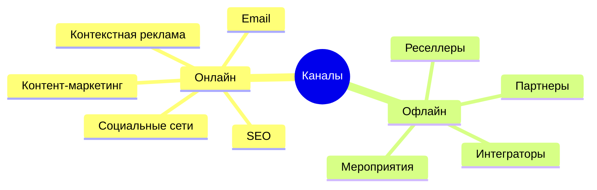
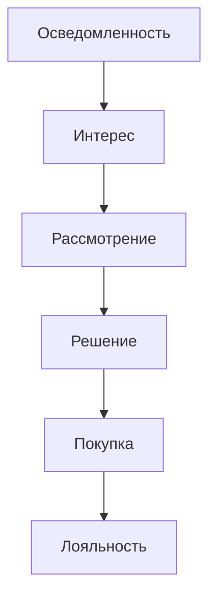
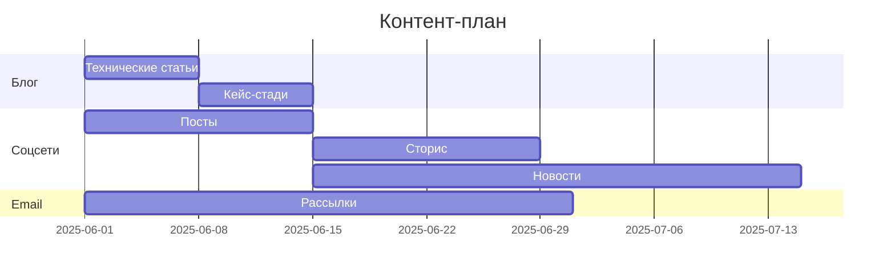
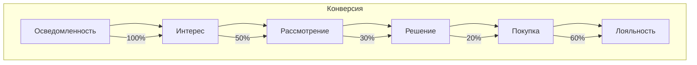
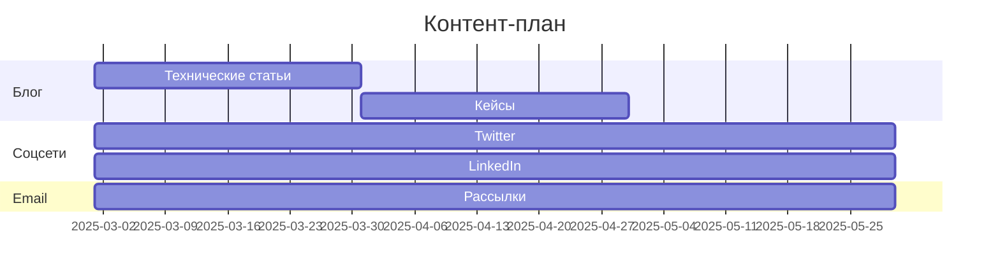
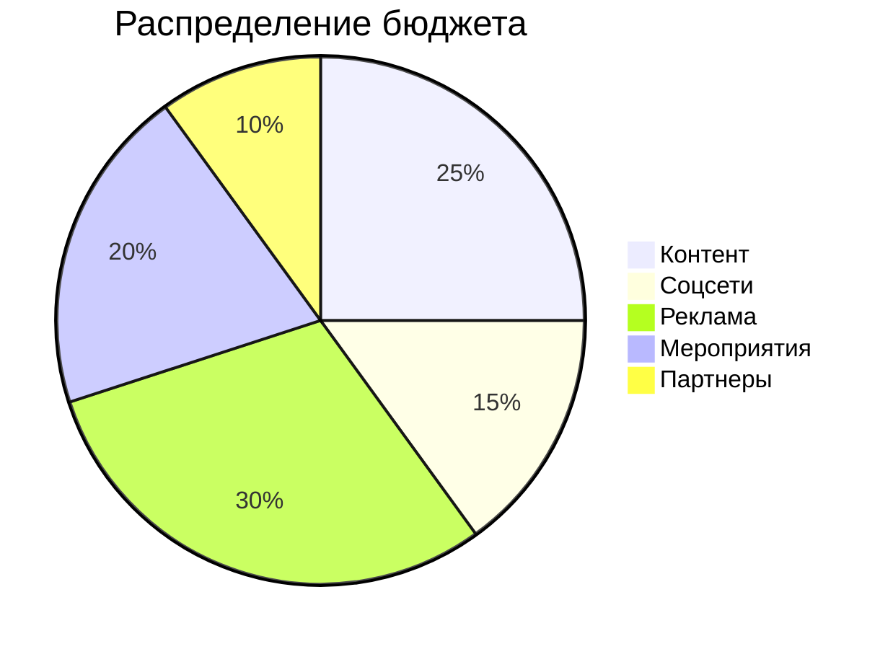

# Стратегия продвижения продукта

## 1. Целевые аудитории

### 1.1 Основные сегменты
1. **Заказчики проектов**
   - Бизнес-компании
   - Стартапы
   - Фрилансеры
   - Некоммерческие организации

2. **Исполнители задач**
   - Разработчики
   - Дизайнеры
   - Маркетологи
   - Консультанты

### 1.2 Вторичные сегменты
1. **Технические специалисты**
   - Блокчейн-разработчики
   - AI-специалисты
   - DevOps-инженеры
   - Архитекторы

2. **Бизнес-аудитория**
   - Инвесторы
   - Партнеры
   - Интеграторы
   - Консультанты

## 2. Каналы продвижения

### 2.1 Онлайн-каналы
1. **Социальные сети**
   - Twitter
     * Технический контент
     * Кейсы использования
     * Новости проекта
     * Взаимодействие с сообществом
   
   - LinkedIn
     * B2B продвижение
     * Профессиональные статьи
     * Кейсы бизнес-решений
     * Сетевые мероприятия
   
   - Telegram
     * Новости проекта
     * Технические обсуждения
     * Поддержка пользователей
     * Эксклюзивные предложения
   
   - GitHub
     * Технические решения
     * Документация
     * Примеры кода
     * Вклад в сообщество

2. **Контекстная реклама**
   - Google Ads
     * Поисковая реклама
     * Рекламная сеть
     * Ретаргетинг
     * Аналитика

3. **Контент-маркетинг**
   - Технический блог
     * Статьи о технологиях
     * Руководства
     * Кейсы
     * Аналитика
   
   - Email-рассылки
     * Новости
     * Обновления
     * Специальные предложения
     * Полезный контент

### 2.2 Офлайн-каналы
1. **Конференции**
   - Технические конференции
     * Доклады
     * Воркшопы
     * Стенды
     * Нетворкинг
   
   - Бизнес-мероприятия
     * Презентации
     * Круглые столы
     * Партнерские встречи
     * Деловые завтраки

2. **Партнерские программы**
   - Реферальная система
     * Бонусы за привлечение
     * Партнерские условия
     * Маркетинг-киты
     * Поддержка партнеров
   
   - Интеграторы
     * Техническая документация
     * API доступ
     * Обучение
     * Совместные проекты

## 3. План продвижения

### 3.1 Предзапуск
1. **Подготовительный этап**
   - Создание лендинга
   - Подготовка контента
   - Настройка аналитики
   - Формирование базы

2. **Анонс продукта**
   - Пресс-релизы
   - Социальные сети
   - Email-рассылки
   - Партнерские каналы

### 3.2 Запуск
1. **Основные активности**
   - Презентация продукта
   - Партнерские запуски
   - Промо-кампании
   - Специальные предложения

2. **Поддерживающие активности**
   - Контент-план
   - Социальные активности
   - Email-маркетинг
   - Ретаргетинг

### 3.3 Пост-запуск
1. **Масштабирование**
   - Расширение каналов
   - Оптимизация конверсии
   - Увеличение охвата
   - Глубокая аналитика

2. **Удержание**
   - Программы лояльности
   - Регулярные обновления
   - Обратная связь
   - Поддержка сообщества

## 4. Диаграммы продвижения

### 4.1 Схема каналов продвижения

### 4.2 Схема воронки продаж

### 4.3 Схема контент-плана

# План продвижения продукта

## 1. Целевые показатели

### 1.1 Количественные показатели
1. **Пользователи**
   - Активные пользователи: 10,000 (год 1)
   - Ежемесячный прирост: 20%
   - Удержание: 60%
   - Конверсия: 5%

2. **Проекты**
   - Всего проектов: 1,000 (год 1)
   - Успешных проектов: 80%
   - Средний бюджет: $5,000
   - Повторные заказы: 40%

### 1.2 Качественные показатели
1. **Вовлеченность**
   - Время на сайте: 15 минут
   - Глубина просмотра: 5 страниц
   - Возвращаемость: 70%
   - NPS: 40

2. **Удовлетворенность**
   - Общая оценка: 4.5/5
   - Качество сервиса: 4.7/5
   - Поддержка: 4.6/5
   - Рекомендации: 4.4/5

## 2. Бюджет продвижения

### 2.1 Маркетинговый бюджет
1. **Онлайн-продвижение**
   - Социальные сети: $30,000
     * Twitter: $10,000
     * LinkedIn: $10,000
     * Telegram: $5,000
     * GitHub: $5,000
   
   - Контекстная реклама: $20,000
     * Google Ads: $10,000
     * Социальные сети: $5,000
     * Промо-посты: $5,000

2. **Офлайн-продвижение**
   - Мероприятия: $60,000
     * Конференции: $30,000
     * Круглые столы: $15,000
     * Партнерские встречи: $10,000
     * Деловые завтраки: $5,000
   
   - Партнерские программы: $40,000
     * Реферальная система: $15,000
     * Интеграторы: $10,000
     * Маркетинг-киты: $15,000

### 2.2 Операционные затраты
1. **Команда**
   - Маркетологи: $120,000
   - Контент-специалисты: $60,000
   - SMM-менеджеры: $40,000
   - Аналитики: $30,000

2. **Инструменты**
   - CRM: $10,000
   - Аналитика: $5,000
   - Автоматизация: $5,000
   - Дизайн: $10,000

## 3. План действий

### 3.1 Предзапуск (3 месяца)
1. **Подготовительный этап**
   - Создание лендинга
     * Дизайн: 2 недели
     * Разработка: 3 недели
     * Тестирование: 1 неделя
   
   - Подготовка контента
     * Технические статьи: 20 шт.
     * Кейсы: 10 шт.
     * Видео: 5 шт.
     * Вебинары: 3 шт.

2. **Формирование базы**
   - Сбор контактов: 10,000
   - Сегментация: 5 групп
   - Подготовка рассылок: 3 варианта
   - Настройка автоматизации

### 3.2 Запуск (1 месяц)
1. **Основные активности**
   - Презентация продукта
     * Онлайн-трансляция
     * Пресс-релиз
     * Социальные сети
     * Email-рассылка
   
   - Партнерские запуски
     * 5 ключевых партнеров
     * Совместные акции
     * Перекрестное продвижение
     * Специальные условия

2. **Промо-кампании**
   - Специальные предложения
     * Скидки: 20%
     * Бонусы: $100
     * Бесплатный период: 1 месяц
     * Эксклюзивные функции

### 3.3 Пост-запуск (3 месяца)
1. **Масштабирование**
   - Расширение каналов
     * Новые соцсети
     * Дополнительные партнеры
     * Региональные представители
     * Интеграции
   
   - Оптимизация
     * A/B тестирование
     * Анализ конверсии
     * Улучшение UX
     * Ускорение процессов

2. **Удержание**
   - Программы лояльности
     * Бонусная система
     * Уровни доступа
     * Привилегии
     * Эксклюзивные предложения
   
   - Поддержка сообщества
     * Форум
     * Чат поддержки
     * База знаний
     * Регулярные обновления

## 4. Ожидаемые результаты

### 4.1 Краткосрочные (3 месяца)
1. **Метрики**
   - Пользователи: 2,500
   - Проекты: 250
   - Доход: $250,000
   - ROI: 25%

2. **Качество**
   - Удовлетворенность: 4.0/5
   - NPS: 30
   - Удержание: 50%
   - Конверсия: 3%

### 4.2 Среднесрочные (6 месяцев)
1. **Метрики**
   - Пользователи: 5,000
   - Проекты: 500
   - Доход: $500,000
   - ROI: 50%

2. **Качество**
   - Удовлетворенность: 4.3/5
   - NPS: 35
   - Удержание: 55%
   - Конверсия: 4%

### 4.3 Долгосрочные (12 месяцев)
1. **Метрики**
   - Пользователи: 10,000
   - Проекты: 1,000
   - Доход: $1,000,000
   - ROI: 100%

2. **Качество**
   - Удовлетворенность: 4.5/5
   - NPS: 40
   - Удержание: 60%
   - Конверсия: 5%

## 5. Диаграммы продвижения

### 5.1 Схема воронки продаж

### 5.2 Схема контент-плана

### 5.3 Схема ROI

## 6. Заключение

### 6.1 Ключевые моменты
1. **Приоритеты**
   - Качество контента
   - Взаимодействие с сообществом
   - Измерение эффективности
   - Оптимизация процессов

2. **Риски**
   - Изменения алгоритмов
   - Конкуренция
   - Ресурсы
   - Внешние факторы

### 6.2 Рекомендации
1. **Немедленные действия**
   - Запуск контент-плана
   - Настройка аналитики
   - Формирование команды
   - Подготовка материалов

2. **Долгосрочные меры**
   - Масштабирование каналов
   - Оптимизация процессов
   - Развитие партнерств
   - Улучшение метрик 